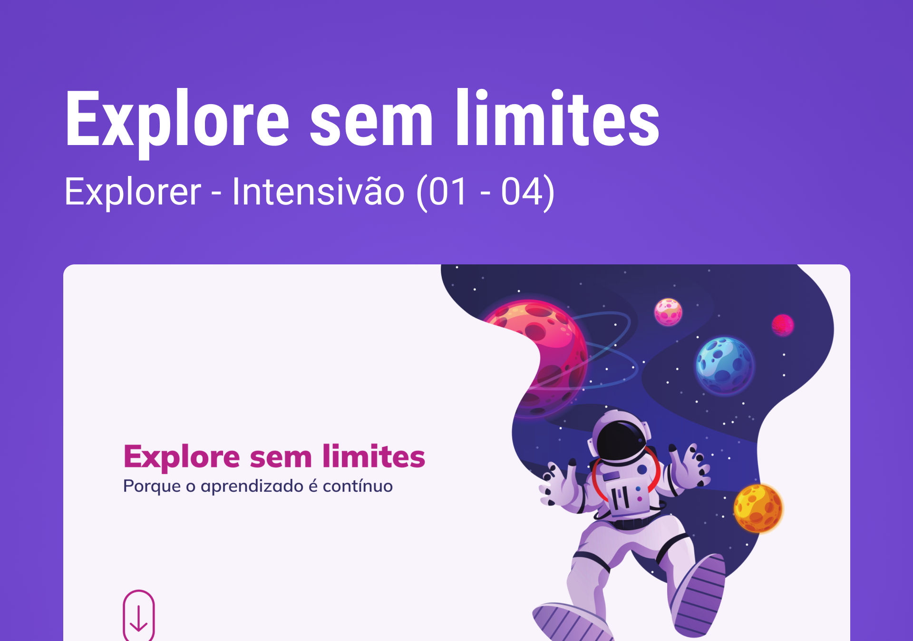

<h1>Explore-Sem-Limites✨
Explorer - Intensivão (01 - 04)
Recriando Layout
</h1>

 

 <h2>Projeto construido atraves dos desafios do Intensivão do Explorer.</h2>

<h3>🧰🛠️ Tecnologias</h3>

HTML
CSS  
Git e Github  
Grid  
Animação 
@media 
@Keyframe 
CSS Clamp 
FlexBox 

<h1>Acesso a Pagina</h1>
https://cloudsld.github.io/Desafio---Explore-sem-limites/

💛 Contato

Cjbrvii@gmail.com

Linkedin : https://www.linkedin.com/in/victor-hugo-oliveira-b64521214/

<h3>Confesso que tive grandes desafios e diversidades porém como um bom dev curioso e cheio de expectativas e curiosidades pude extrair o máximo de conhecimento e aprendizado desse projeto que nos foi apresentado pela Rocktseat. Agradeço ao prof Mayk por todo conhecimento e pelas aulas divertidas e descomplicadas que nos deixam mais à vontade e com sede por mais e mais conhecimento e querer sempre aprender o máximo no nosso ritmo e mantendo a constância. Talvez esse seja meu ultimo stage porém pude aproveitar ao máximo cada aula até aqui e agradeço por me ajudarem nos meus primeiros passos nesse mundo da programação. 😄👾

De volta aos estudos com tudo. 😁bora codar.</h3>

